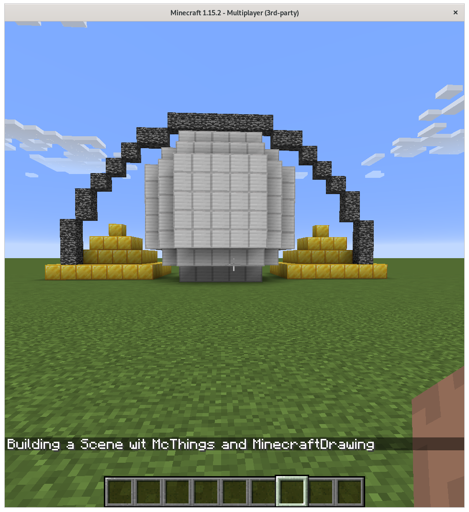

# McThings 

A framework for building a Scene with Things implemented using the
[Raspberry PI Minecraft](https://www.minecraft.net/en-us/edition/pi/)
[API](https://www.stuffaboutcode.com/p/minecraft-api-reference.html). It is based
on [mcpi library](https://github.com/martinohanlon/mcpi).

A Thing is a built based on blocks: [Pyramid](mcthings/pyramid.py), [River](mcthings/river.py),
[House](mcthings/house.py), [Fence](mcthings/fence.py)
and may others. All the Things share the [Thing API](mcthings/thing.py).

A [Scene is a list](mcthings/scene.py) of Things built in a specific position. Scenes can be shared
loading and saving them to a [files](scenes/scene.mct). All the [tests](tests) are scenes. [This one](scenes/scene.py) includes
a river, a house in each side of the river and a bridge for crossing the river.

Things can be built using [MinecraftDrawing](https://minecraft-stuff.readthedocs.io/en/latest/index.html). 
[Sphere](mcthings/sphere.py) and [Circle](mcthings/circle.py) Things are used with Pyramids in the next 
[scene](scenes/scene_sphere_circle_pyramid.py):

