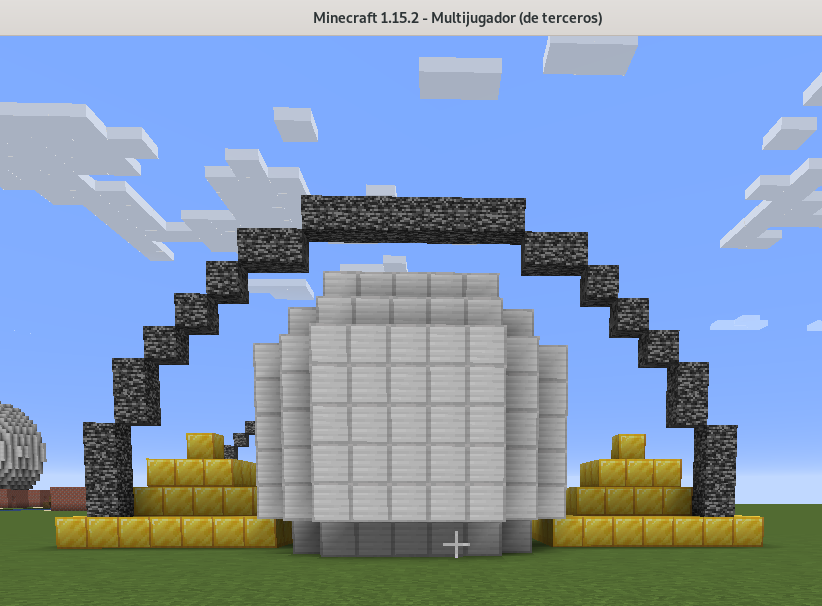
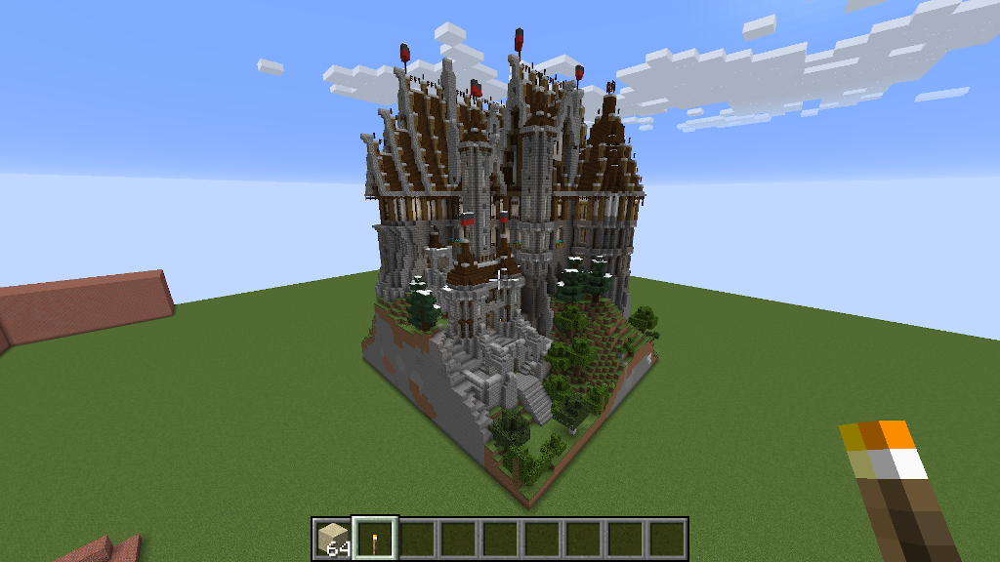

# McThings  

A Python programming framework for building Scenes in Minecraft. Scenes are compositions of Things (Python objects) implemented using the
[Raspberry PI Minecraft](https://www.minecraft.net/en-us/edition/pi/)
[API](https://www.stuffaboutcode.com/p/minecraft-api-reference.html) (which also works in [Minetest](https://github.com/arpruss/raspberryjammod-minetest)). It is based
on [mcpi library](https://github.com/martinohanlon/mcpi). 
[This is the reference notebook](https://github.com/juntosdesdecasa/minecraft/blob/develop/server/data/python/scene0_10.ipynb)
with a complete sample. And there is a [intro video tutorial](https://www.youtube.com/watch?v=p6NUFdUbcYk&t=2s) and [a more complete one](https://www.youtube.com/watch?v=teGjAXomBVs&t=4s).

A Thing is a built based on blocks: [Pyramid](mcthings/pyramid.py), [River](mcthings/river.py),
[House](mcthings/house.py), [Fence](mcthings/fence.py)
and may others. All the Things share the [Thing API](mcthings/thing.py).

A [Scene is a list](mcthings/scene.py) of Things built in a specific position. Scenes can be shared
loading and saving them to a [files](scenes/utils/scene_basic.mct). You [can share scenes adding them
here](scenes). [This one](scenes/utils/scene_basic.py) includes
a river, a house in each side of the river and a bridge for crossing the river.

Things can be built using [MinecraftDrawing](https://minecraft-stuff.readthedocs.io/en/latest/index.html). 
[Sphere](mcthings/sphere.py) and [Circle](mcthings/circle.py) Things are used with Pyramids in the next 
[scene](scenes/scene_sphere_circle_pyramid.ipynb):

And Things can also be built from [Schematics](https://www.minecraft-schematics.com/) (there are thousands!). 
There is a [sample notebook](scenes/Schematics.ipynb).

